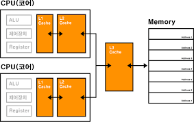

# CHAPTER 01_컴퓨터 구조
### **💜 컴퓨터 구조의 큰 그림**
### <컴퓨터가 이해하는 정보>

`데이터`
숫자, 문자, 이미지, 동영상과 같은 정적인 정보  
`명령어`
데이터를 활용하는 정보

**❗️ 데이터는 명령어에 종속적인 정보이며, 명령의 대상이자, 명령어의 재료**

#### ✅ 컴퓨터는 0과 1만을 이해할 수 있음   
  ➡️ 데이터와 명령어 또한 0과 1로 이루어져 있음
#### ✅ 명령어를 실행하는 주체 = CPU  
  ➡️ CPU의 종류에 따라 실행 가능한 명령어 종류와 처리 양상이 달라질 수 있음

---

### <컴퓨터의 핵심 부품>

#### 1. CPU : 데이터와 명령어를 읽어 들이고, 해석하고 실행하는 부품
| 장치 | 역할 |
|---|---|
| 1. 산술논리연산장치 (ALU, Arithmetic and Logic Unit) | - 일종의 계산기 |
| 2. 제어장치 (CU, Control Unit) | - 명령어를 해석해 제어 신호를 내보내는 장치 |
| 3. 레지스터 (register) | - CPU 내부의 작은 임시 저장장치 |

#### 2. 메모리와 캐시 메모리
✅ RAM
- 실행 중인 프로그램을 구성하는 데이터와 명령어를 저장하는 부품
- `주소` CPU가 메모리에 접근할 때 빠르게 작동하기 위해 필요한 개념
- `휘발성` 전원이 공급되지 않을 때 저장하고 있는 정보가 지워지는 특성

✅ 캐시 메모리
- CPU와 메모리 사이에는 반드시 하나 이상의 캐시 메모리 존재
- 빠른 메모리 접근을 보조하는 저장장치
#### 3. 보조기억장치
- 비휘발성 저장장치
- 하드 디스크, SSD, USB, SD 카드 등
- 보관할 프로그램 저장   

**❗️ CPU가 보조기억장치에 저장된 프로그램을 곧장 가져와 실행할 수 없음**

#### 4. 입출력장치
- 컴퓨터 외부에 연결되어 컴퓨터 내부와 정보를 교환하는 장치
- 마우스, 키보드, 마이크 (입력장치)
- 스피커, 모니터, 프린터 (출력장치)

#### 5. 메인 보드와 버스
`메인 보드 or 마더 보드` 부품들을 고정하고 연결하는 기판   
`버스` 각 컴퓨터 부품들이 정보를 주고받는 통로   
`시스템 버스` 핵심 부품들을 연결하는 시스템 버스

### 🙌 저장장치의 계층 구조
1. CPU와 가까운 저장장치는 빠르고, 멀리 있는 저장장치는 느림
2. 속도가 빠른 저장장치는 용량이 작고, 가격이 비쌈

---

### **💜컴퓨터가 이해하는 정보**

`bit` 
- '0'과 '1'을 나타내는 가장 작은 정보의 단위
- N비트 = 2^N개의 정보

|구분|비트|
|---|---|
|1 byte|8 bit|
|1 kB|1000 byte|
|1 MB|1000 KB|
|1 GB|1000 MB|
|1 TB|1000 GB|

⬆️ 프로그램 관점에서 본 정보 단위   
⬇️ CPU 관점에서 본 정보 단위

`word`

- CPU가 한 번에 처리할 수 있는 데이터의 크기
- 현대 컴퓨터는 대부분 32bit or 64bit

---

### <데이터 - 0과 1로 숫자 표현하기>
`2진법` 숫자 1을 넘어가는 시점에 자리올림   
`부동 소수점` 소수점이 유동적   

✅ IEEE 754 (부동 소수점 저장 방식)

- 지수 : 바이어스값(=2^(k-1)-1) + 지수
- 갸수 : 정수부는 정규화된 1의 값이 들어감. 따라서 소수 부분만 저장

---

### <데이터 - 0과 1로 문자 표현하기>
`encoding` : 0과 1로 이루어진 문자 코드로 변환하는 과정
`decoding` : 사람이 이해하는 문자로 변환하는 과정

✅ ASCII : 8bit로 표현. 이 중 1bit = parity bit (오류 검출 비트)
- base64 : 이진 데이터까지 모두 아스키 문자 형태로 표현 가능  

✅ EUC-KR : 한글 인코딩 방식 중 하나

✅ unicode : 통일된 문자 집합 
- 유니코드 인코딩 방식 : UTF-8, UTF-16, UTF-32 등 가변 길이 인코딩

---

### <명령어>
`연산 코드` : 명령어가 수행할 동작   
| 유형 | 연산 코드 | 설명 |
|-----|-----|-----|
|데이터 전송|MOVE|데이터를 옮겨라|
||STORE|메모리에 저장해라|
||LOAD(FETCH)|데이터를 메모리에서 CPU로 가져와라|
||PUSH|데이터를 스택에 저장해라|
||POP|스택의 최상단 데이터를 가져와라|
|산술/논리 연산|ADD/SUBTRACT/ MULTIPLY/DIVIDE|사칙연산을 수행하라|
||INCREMENT DECREMENT|오퍼랜드에 1을 더해라 오퍼랜드에 1을 빼라|
||AND/OR/NOT|AND/OR/NOT 연산을 수행하라|
||COMPARE|값을 비교해라|
|제어 흐름 변경|JUMP|특정 주소로 실행 순서를 옮겨라|
||CONDITIONAL JUMP|조건에 부합할 경우 특정 주소로 실행 순서를 옮겨라|
||HALT|프로그램의 실행을 멈춰라|
||CALL|돌아올 주소를 저장한 채 특정 주소로 실행 순서를 옮겨라|
||RETURN|CALL을 호출할 때 저장했던 주소로 돌아가라|
|입출력 제어|READ(INPUT)|데이터를 읽어라|
||WRITE(OUTPUT)|데이터를 써라|
||START IO|입출력장치를 시작해라|
||TEST IO|입출력장치의 현재 상태를 확인하라|

`오퍼랜드` : 동작에 사용될 데이터 or 동작에 사용될 데이터가 저장된 위치

`기계어` : '0'과 '1'을 있는 그대로 표현한 언어   
`어셈블리어` : 기계어를 읽기 편한 형태로 단순 번역한 언어

✅ 명령어 사이클 : 명령어들이 반복하며 실행되는 주기   
`인출 사이클` : 명령어를 CPU로 가져오는 단계   
`실행 사이클` : 명령어를 실행하는 단계   
`간접 사이클` : 명령어를 실행하기 위해 한 번 더 메모리에 접근하는 단계

---

### **💜 CPU**
### <레지스터>
`프로그램 카운터 (PC)` : 메모리에서 다음으로 읽어 들일 명령어의 주소를 저장   
`명령어 레지스터 (IR)` : 해석할 명령어 저장   
`범용 레지스터 (general purpose register)` : 자유롭게 사용 가능  
`플래그 레지스터 (flag register)` : flag값 저장  
|종류|설명|
|---|---|
|부호 플래그|연산 결과의 부호|
|제로 플래그|연산 결과가 0인지 여부|
|캐리 플래그|올림수나 빌림수가 발생했는지 여부|
|오버플로우 플래그|오버플러그가 발생했는지 여부|
|인터럽트 플래그|인터럽트가 가능한지 여부|
|슈펴바이저 플래그|커널 모드로 실행 중인지, 사용자 모드로 실행 중인지 여부|

`스택 포인터` : 최상단 스택 데이터 위치를 가리킴

---

### <인터럽트>
`인터럽트` : CPU의 작업을 방해하는 신호

✅ 동기 인터럽트
- CPU에 의해 발생
- 프로그래밍 오류와 같은 예외적인 상황을 마주쳤을 때 발생
  - `폴트(fault)` : 예외가 발생한 명령어부터 실행 재개
  - `트랩(trap)` : 예외가 발생한 다음 명령어부터 실행 재개
  - `중단(abort` : 프로그램 강제 중단할 수 밖에 없는 심각한 오류를 발견했을 경우
  - `소프트웨어 인터럽트` : 시스템 콜이 발생했을 경우

✅ 비동기 인터럽트

- 입출력장치에 의해 발생
- 알림의 역할
- `폴링(polling)` : 입출력 상태가 어떤지, 처리할 데이터가 있는지 주기적으로 확인하는 것
- 처리순서
  1) 입출력장치는 CPU에게 인터럽트 요청 신호를 보냄
  2) CPU는 실행 사이클이 끝나고 항상 인터럽트 여부 확인
  3) 인터럽트 플래그 확인
  4) 인터럽트 플래그가 '1'이면 지금까지 작업 백업
  5) 인터럽트 벡터를 참조하여 인터럽트 서비스 루틴 실행
  6) 인터럽트 서비스 루틴이 끝나면 백업해 둔 작업을 복구하여 실행 재개
- `인터럽트 요청 신호` : CPU에게 인터럽트 가능 여부 확인하기 위한 신호   
**❗️인터럽트 플래그로 막을 수 있는 인터럽트와 막을 수 없는 인터럽트가 있음**
- `인터럽트 서비스 루틴 = 인터럽트 핸들러` : 인터럽트를 어떻게 처리하고 작동할지에 대한 정보로 이루어진 프로그램 
- `인터럽트 벡터` : 인터럽트 서비스 루틴의 시작 주소를 포함한 인터럽트 서비스 루틴을 식별하기 위한 정보
- 현재 프로그램을 재개하기 위해 필요한 모든 내용을 스택에 백업 ex) 프로그램 카운터 값 등

---

### <CPU 성능 향상을 위한 설계>

✅ CPU 클럭 속도   

`클럭` : 컴퓨터의 부품을 일사불란하게 움직일 수 있게 하는 시간의 단위
- 클럭 속도 = Hz   
❗️ 클럭 속도를 필요 이상으로 높으면 컴퓨터의 발열 발생

`멀티코어와 멀티스레드`   
✅ `코어` : CPU 내에서 명령어를 읽어 들이고, 해석하고, 실행하는 부품   
✅ `멀티코어 CPU or 멀티코어 프로세서` : 어려개의 코어를 포함하고 있는 CPU

✅ `thread` : 실행 흐름의 단위
- 하드웨어적인 스레드 : 하나의 코어가 동시에 처리하는 명령어의 단위 = 논리 프로세서
- 소프트웨어적인 스레드 : 하나의 프로그램에서 독립적으로 실행되는 단위   

`병렬성` : 작업을 물리적으로 동시에 처리 ex) 스레드가 4개인 CPU   
`동시성` : 동시에 작업을 처리하는 것처럼 보임

---

### <파이프라닝을 통한 명령어 병렬 처리>

`명령어 파이프라이닝`

<명령어 처리 과정>
1. 명령어 인출
2. 명령어 해석
3. 명령어 실행
4. 결과 저장   
   
❗️ 각각의 단계 동시 실행 가능  
❗️ 명령어 파이프라인에 넣고 동시에 처리하는 기법이 `명령어 파이프라이닝`

🙌 `슈퍼스칼라` : CPU 내부에 여러 명령어 파이프라인 포함 구조

<명령어 집합 유형>
1. CISC : 다채로운 기능을 지원하는 복잡한 명령어들로 구성
2. RISC : 짧고 규격화된 명령어, 되도록 1클럭 내외

❗️CISC는 여러 클럭 주기 필요하므로 병열 처리에는 RISC 유리

<파이프라인 위험>

1. `데이터 위험` : 명령어 간 데이터 의존성에 의해 발생
2. `제어 위험` : 프로그램 카운터의 갑작스러운 변화에 의해 발생
3. `구조적 위험` : 서로 다른 명령어가 동시에 ALU, 레지스터 등 같은 CPU 부품을 사용하려할 경우 발생

---

### **💜 메모리**

### <RAM>

- 휘발성 저장장치
- RAM의 용량이 컴퓨터에 큰 영향
- RANDOM ACCESS MEMORY의 약자로, 임의의 위치에 곧장 접근 가능

✅ DRAM 
- 시간이 지나면 저장된 데이터가 점차 사라짐
- 일반적으로 메모리로 사용
- 소비 전력 낮고 저렴하며, 집적도가 높음

✅ SRAM
- 시간이 지나도 저장된 데이터가 사라지지 않음
- DRAM에 비해 빠름
- 소비 전력 크고 가격도 비싸고, 집적도도 낮음   

❗️ 대용량으로 만들 필요는 없지만 속도가 빨라야 하는 캐시 메모리 등에 사용

✅ SDRAM
- 쿨럭 신호와 동기화된 DRAM

✅ DDR SDRAM
- 대역폭을 넓혀 속도를 빠르게 만든 SDRAM
- SDRAM 대역폭의 두 배
- DDR2 SDRAM은 DDR SDRAM 대역폭의 2배
- DDR3 SDRAM은 DDR2 SDRAM 대역폭의 2배

---

### <메모리에 바이트를 밀어 넣는 순서>

✅ `빅 엔디안` : 낮은 주소에 상위 바이트부터 저장하는 방식  
- 우리가 숫자를 읽고 쓰는 순서와 동일 => 메모리 값을 직접 읽거나, 디버깅할 때 편리  

✅ `리틀 엔디안` : 낮은 주소에 하위 바이트부터 저장하는 방식
- 수치 계산이 편리

---

### <캐시 메모리>

- CPU의 연산 속도와 메모리 접근 소곧의 차이를 줄이기 위해 탄생한 저장장치
- SRAM 기반의 저장장치

- 크기 : L1 < L2 < L3
- 속도 : L3 < L2 < L1
- 일반적으로 L1, L2는 코어마다 고유한 캐시 메모리 / L3 캐시는 여러 코어가 공유
- 분리형 캐시 : 명령어만을 저장하는 L1I캐시와 데이터만을 저장하는 L1D 캐시

✅ 캐시 히트와 캐시 미스

👉 캐시 메모리는 CPU가 사용할 법한 것을 저장

`캐시 히트` : 실제로 사용된 경우
`캐시 미스` : 예측이 틀린 경우

❗️`캐시 적중률` = 캐시 히트 횟수 / (캐시 히트 횟수 + 캐시 미스 횟수)

✅ 참조 지역성의 원리  
👉 CPU가 메모리에 접근할 때 보이는 주된 경향
- `시간 지역성` : CPU는 최근에 접근했던 메모리 공간에 다시 접근하려는 경향 ex) 변수
- `공간 지역성` : CPU는 접근한 메모리 공간의 근처에 접근하련느 경향 ex) 배열

✅ 캐시 메모리의 쓰기 정책과 일관성

❗️ CPU가 캐시 메모리에 데이터를 쓸 때 캐시 메모리에 새롭게 쓰여진 데이터와 메모리 상의 데이터가 일관성을 유지해야 함.

< 이것의 해결 방법 >

1. 즉시 쓰기 
   - 메모리를 항상 최신 상태로 유지
   - 데이터 쓸 때마다 메모리 참조
2. 지연 쓰기
   - 캐시 메모리에만 값을 써 두었다가 추후 한 번에 메모리에 반영하는 방법
   - 속도는 빠름
   - 일관성 깨질 수 있음 (메모리와 메모리 / 코어간)

---

### **💜 보조기억장치와 입출력장치**

### < RAID >

✅ 하드 디스크 드라이브
- 자기적인 방식으로 데이터를 읽고 쓴느 보조기억장치

✅플래시 메모리
- 전기적인 방식으로 데이터릴 읽고 쓰는 반도체 기반의 저장장치
- USB 메모리나 SD카드, SSD
- 주로 사용되는 플래시 메모리는 SSD

❗️ 보조기억장치의 본분  
1. 전원이 꺼져도 데이터 안전하게 보관
2. CPU가 필요로 하는 정보 조금이라도 빠른 성능으로 메모리에게 전달

👉 이를 위해 사용할 수 있는 기술이 `RAID`

✅ `RAID`
- 데이터의 안정성 or 성능을 확보하기 위해, 여러 개의 독립적인 보조기억장치를 마치 하나의 보조기억장치처럼 사용하는 기술
- RAID 구성 방법 = RAID 레벨   
  : RAID0, RAID1, RAID2, RAID3, RAID4, RAID5, RAID6이 대표적  
  : 그로부터 RAID10, RAID50 등이 파생

  ✅ RAID0 : 데이터를 여러 보조기억장치에 단순하게 나누어 저장하는 구성 방식
  - `스트라입` : 줄무늬처럼 분산되어 저장된 데이터
  - `스트라이핑` : 분산하여 저장하는 동작
  - 장점 : 빠른 입출력
  - 단점 : 저장된 정보가 불안전

  ✅ RAID1 : 완전한 복사본을 만들어 저장하는 구성 방식 => '미러링'이라고도 부름
  - 장점 : 복구가 간단하고 안정성이 높음
  - 단점 : 쓰기 속도 느리고, 복사본만큼 사용 가능한 용량이 적어짐

  ✅ RAID4 : 패리티 정보를 저장하는 디스크를 따로 두는 구성 방식
  - 장점 : RAID1에 비해 적은 하드 디스크 필요
  - 단점 : 패리티를 저장하는 장치에 병목 현상 발생

  ✅ RAID5 : 패리티를 분산하여 저장하는 구성 방식
  - RAID4의 단점인 병목 현상 보완 가능

  ✅ RAID6 : 서로 다른 2개의 패리티를 두는 구성 방식
  - 장점 : RAID4나 RAID5에 비해 안전성 높음
  - 단점 : 패리티 2개로 쓰기 속도 느림

  🙌 Nested RAID : 여러 RAID 레벨을 혼합한 방식
  
  - RAID10 : RAID0 + RAID1
  - RAID50 : RAID0 + RAID5

---

### < 입출력 기법 >
✅ 장치 컨트롤러와 장치 드라이버  
`장치 컨트롤러`  
- 모든 입출력장치는 각자의 장치 컨트롤러를 통해 컴퓨터 내부와 연결되어 정보를 주고받음  
📝 장치 컨트롤러에는 RAM과 같은 저장장치가 있는 경우가 많음 ❓ CPU와 정보 주고받아야하므로

`장치 드라이버`
- 장치 컨트롤러의 동작을 알고, 장치 컨트롤러가 컴퓨터 내부와 정보를 주고받을 수 있도록 하는 프로그램

✅ 프로그램 입출력 : 프로그램 속 명령어로 입출력 작업을 수행하는 방법

🙌 `고립형 입출력` : 입출력장치에 접근하는 주소와 메모리에 접근하는 주소 별도 간주 ↔️ `메모리 맵 입출력`

✅ 인터럽트 기반 입출력: 다중 인터럽트

`PIC (Programmable Interrupt Controller)`
- 장치 컨트롤러에서 보낸 하드웨어 인터럽트 요청들의 우선순위를 판별한 뒤, 지금 처리해야 할 인터럽트를 CPU에게 알려 주는 장치

✅ DMA 입출력

프로그램 기반의 입출력과 인터럽트 기반의 입출력의 공통점 = CPU가 입출력장치와 메모리간의 데이터 이동을 주도해야 하며, 이동하는 데이터들도 반드시 CPU를 거친다!

➡️ `DMA` : 직접 메모리에 접근할 수 있는 입출력 기능 (DMA 컨트롤러 필요)
1. CPU가 DMA 컨트롤러에게 여러 정보와 함께 입출력 작업을 명령
2. 입출력 작업 수행
3. 작업이 끝난 후 CPU에게 인터럽트 걸어 작업 끝남 알림

🙌 시스템 버스는 동시 사용 불가 => CPU 입장에서는 버스에 접근하는 사이클을 도둑 맞는 기분 => DMA의 시스템 버스 사용을 `사이클 스틸링`이라고 부름

`PCle` : 대표적입 입출력 버스
1. PCle 버전에 따라 최대 속도 달라질 수 있음
2. 여러 레인을 이용해 정보를 주고받을 수 있음 (레인 : PCle 버스를 통해 정보를 송수신하는 단위)

---

++ NOTE 
### <GPU의 용도와 처리방식>
- 대량의 그래픽 연산
- 범용적인 목적의 GPU 사용 기술 = GPGPU(General-Purpose computing on Graphics Processing Units)
- GPU 개별 코어의 성능은 CPU의 코어보다 떨어짐
- 수백 개에서 많게는 수천 개의 코어가 포함 = 병렬 처리에 유리
- GPU는 산순 연산과 같이 단순한 연산을 빠르게, 병렬적으로 수행 / CPU는 범용적인 연산 수행  
=> GPU를 CPU의 보조프로세서라고 부르기도 함
