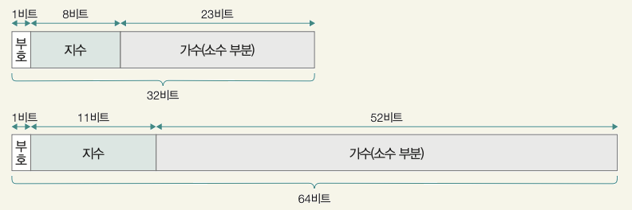

# CHAPTER 01_컴퓨터 구조
### **💜 컴퓨터 구조의 큰 그림**
### <컴퓨터가 이해하는 정보>

`데이터`
숫자, 문자, 이미지, 동영상과 같은 정적인 정보  
`명령어`
데이터를 활용하는 정보

**❗️ 데이터는 명령어에 종속적인 정보이며, 명령의 대상이자, 명령어의 재료**

#### ✅ 컴퓨터는 0과 1만을 이해할 수 있음   
  ➡️ 데이터와 명령어 또한 0과 1로 이루어져 있음
#### ✅ 명령어를 실행하는 주체 = CPU  
  ➡️ CPU의 종류에 따라 실행 가능한 명령어 종류와 처리 양상이 달라질 수 있음

---

### <컴퓨터의 핵심 부품>

#### 1. CPU : 데이터와 명령어를 읽어 들이고, 해석하고 실행하는 부품
| 장치 | 역할 |
|---|---|
| 1. 산술논리연산장치 (ALU, Arithmetic and Logic Unit) | - 일종의 계산기 |
| 2. 제어장치 (CU, Control Unit) | - 명령어를 해석해 제어 신호를 내보내는 장치 |
| 3. 레지스터 (register) | - CPU 내부의 작은 임시 저장장치 |

#### 2. 메모리와 캐시 메모리
✅ RAM
- 실행 중인 프로그램을 구성하는 데이터와 명령어를 저장하는 부품
- `주소` CPU가 메모리에 접근할 때 빠르게 작동하기 위해 필요한 개념
- `휘발성` 전원이 공급되지 않을 때 저장하고 있는 정보가 지워지는 특성

✅ 캐시 메모리
- CPU와 메모리 사이에는 반드시 하나 이상의 캐시 메모리 존재
- 빠른 메모리 접근을 보조하는 저장장치
#### 3. 보조기억장치
- 비휘발성 저장장치
- 하드 디스크, SSD, USB, SD 카드 등
- 보관할 프로그램 저장   

**❗️ CPU가 보조기억장치에 저장된 프로그램을 곧장 가져와 실행할 수 없음**

#### 4. 입출력장치
- 컴퓨터 외부에 연결되어 컴퓨터 내부와 정보를 교환하는 장치
- 마우스, 키보드, 마이크 (입력장치)
- 스피커, 모니터, 프린터 (출력장치)

#### 5. 메인 보드와 버스
`메인 보드 or 마더 보드` 부품들을 고정하고 연결하는 기판   
`버스` 각 컴퓨터 부품들이 정보를 주고받는 통로   
`시스템 버스` 핵심 부품들을 연결하는 시스템 버스

### 🙌 저장장치의 계층 구조
1. CPU와 가까운 저장장치는 빠르고, 멀리 있는 저장장치는 느림
2. 속도가 빠른 저장장치는 용량이 작고, 가격이 비쌈

---

### **💜컴퓨터가 이해하는 정보**

`bit` 
- '0'과 '1'을 나타내는 가장 작은 정보의 단위
- N비트 = 2^N개의 정보

|구분|비트|
|---|---|
|1 byte|8 bit|
|1 kB|1000 byte|
|1 MB|1000 KB|
|1 GB|1000 MB|
|1 TB|1000 GB|

⬆️ 프로그램 관점에서 본 정보 단위   
⬇️ CPU 관점에서 본 정보 단위

`word`

- CPU가 한 번에 처리할 수 있는 데이터의 크기
- 현대 컴퓨터는 대부분 32bit or 64bit

### <데이터 - 0과 1로 숫자 표현하기>
`2진법` 숫자 1을 넘어가는 시점에 자리올림   
`부동 소수점` 소수점이 유동적   

✅ IEEE 754 (부동 소수점 저장 방식)

- 지수 : 바이어스값(=2^(k-1)-1) + 지수
- 갸수 : 정수부는 정규화된 1의 값이 들어감. 따라서 소수 부분만 저장

### <데이터 - 0과 1로 문자 표현하기>
`encoding` : 0과 1로 이루어진 문자 코드로 변환하는 과정
`decoding` : 사람이 이해하는 문자로 변환하는 과정

1. ASCII : 8bit로 표현. 이 중 1bit = parity bit (오류 검출 비트)
2. EUC-KR : 한글 인코딩 방식 중 하나
3. unicode : 통일된 문자 집합 

